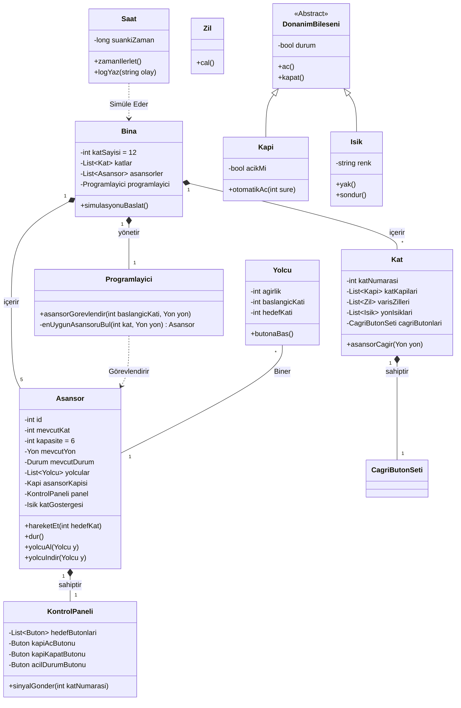

# asansor-simulasyonu
OOP - Asansör Simülasyonu

Kodluyoruz Sigorta Şirketi 12 katlı bir ofis binası inşa etmek ve onu en son asansör teknolojisi ile donatmak istiyor. Şirket, bina içindeki trafik akışı ihtiyaçlarını karşılayıp karşılamayacaklarını görmek için binanın asansörlerinin işlemlerini modelleyen bir yazılım simülatörü oluşturmanızı istiyor.

Binada, her biri binanın 12 katına çıkabilecek beş asansör bulunacaktır. Her asansörün yaklaşık altı yetişkin yolcu kapasitesi vardır. Asansörler enerji tasarruflu olacak şekilde tasarlanmıştır, bu nedenle yalnızca gerektiğinde hareket ederler. Her asansörün kendi kapısı, kat gösterge ışığı ve kontrol paneli vardır. Kontrol panelinde hedef düğmeleri, kapı açma ve kapama düğmeleri ve bir acil durum sinyal düğmesi bulunur.

Binadaki her katta, beş asansör boşluğunun her biri için bir kapı ve her kapı için bir varış zili vardır. Varış zili, asansörlerin bir kata vardığını gösterir. Her kapının üzerinde bulunan bir sinyal ışığı, asansörün gelişini ve asansörün hareket ettiği yönü gösterir. Her katta ayrıca üç set asansör çağrı düğmesi vardır.

Bir kişi uygun çağrı düğmesine (yukarı veya aşağı) basarak bir asansörü çağırır. Bir programlayıcı, aramanın başladığı kata gitmek için beş asansörden birini görevlendirir. Asansöre girdikten sonra, bir yolcu tipik olarak bir veya daha fazla hedef düğmesine basar. Asansör kattan kata hareket ederken, asansörün içindeki bir gösterge ışığı yolcuları asansörün konumu hakkında bilgilendirir. Bir asansörün bir kata varması, dış asansör kapısının üzerindeki gösterge lambasının yakılması ve kat zilinin çalmasıyla belirtilir. Bir asansör bir katta durduğunda, her iki kapı grubu da önceden belirlenmiş bir süre boyunca otomatik olarak açılarak yolcuların asansöre girip çıkmalarına izin verir.

Simülatör, gerçek zaman geçişini simüle etmek ve simülasyonda meydana gelen olayları zaman damgası ve günlüğe kaydetmek için bir "saat" kullanır. Simülatör tarafından yolcu oluşturmak ve her yolcu için kalkış ve varış katlarını belirlemek için rastgele bir sayı üreteci kullanılır.

 

Durum Yönetimi (State Management): Asansörün mevcutDurum (Boşta, Hareket Halinde, Kapılar Açık vb.) bilgisinin kapsüllenmesi (encapsulation), asansörün kendi başına hareket edememesini ve sadece Programlayici tarafından verilen komutlarla hareketEt() metodunu çalıştırmasını sağlar. 

Merkezi Dağıtım: Katlardan gelen asansorCagir() talepleri doğrudan bir asansöre gitmez. Önce Programlayici'ya düşer. Simülasyonda da gördüğünüz o bekleme ve en uygun asansörün seçilme mantığı enUygunAsansoruBul() metodu içinde hesaplanır.
